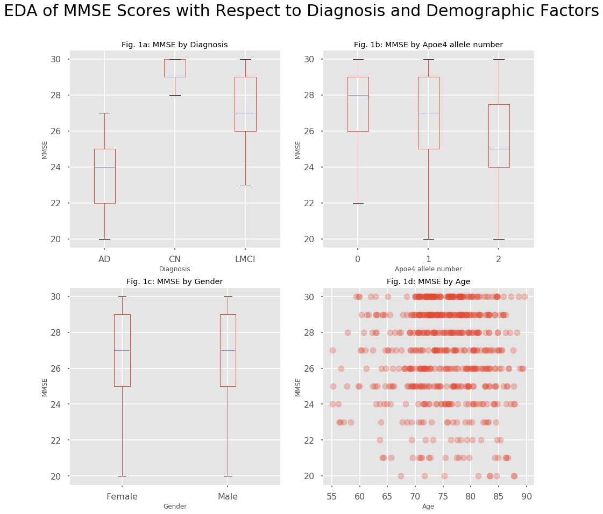
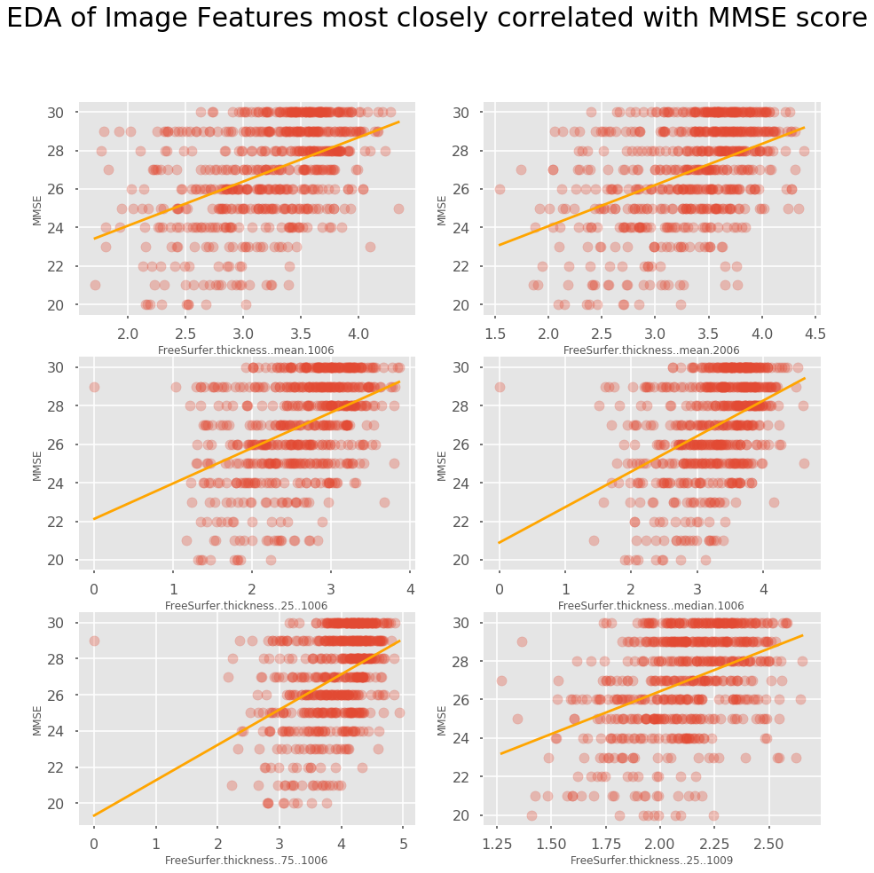
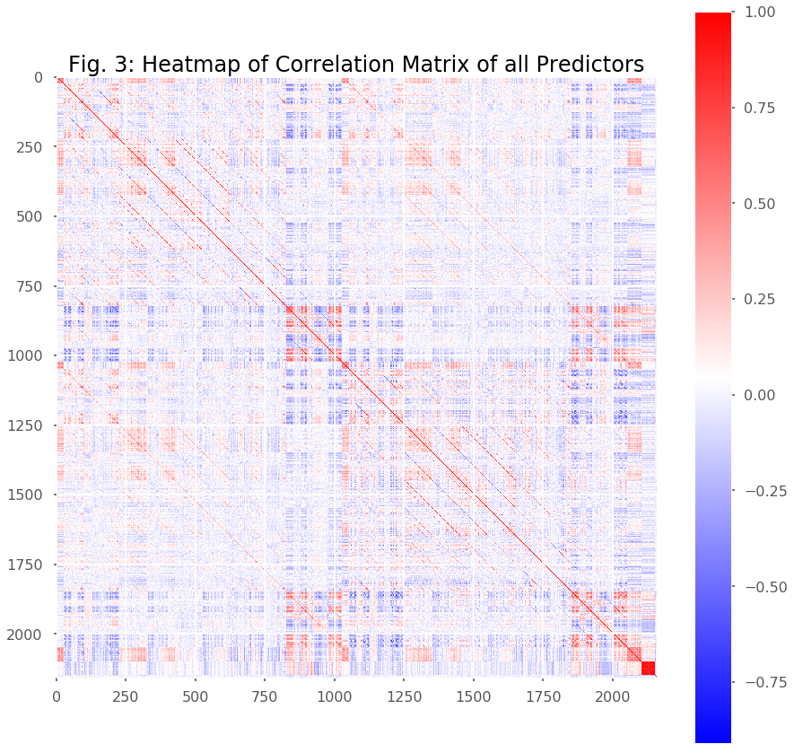

## Contents
{:.no_toc}
*  
{: toc}


  
   
    
Alzheimer's disease (AD) is characterized by 2 major diagnostic features: pathological changes in the brain namely beta-amyloid placques and deterioration of the mental state leading to cognitive impairment and ultimately dementia. Neither of these features is sufficient but both are necessary for a definitive AD diagnosis. While beta-amyloid placques are present very early during disease progression, cognitive impairment only manifests in the latest stages of the disease when a treatment is deemed impossible. In this project, we will focus on these 2 features separately and 1.) try to predict beta-amyloid placques from ???? and 2.) try to predict the mental state from brain imaging data. These 2 parts are inspired by subchallenges 2 and 3 of the ADNI Big Data DREAM Challenge.


### PART 2: Predicting mental state (MMSE) from brain imaging data (MRI)


In the second part of the project, we focus on the question if we can predict the mental state of a patient from brain imaging data. In the ADNI dataset, the mental state is represented by the Mini-Mental State Exam (MMSE) score which is the variable that we are trying to predict in this part of the project.
Since the psychological pathology develops relatively late in the disease progression, it would be advantageous to be able to predict the mental state from MRI brain imaging data which is routinely acquired in clinical settings (e.g. to exclude other types of dementia). In our analysis, we follow closely the the guidelines given in the AD Big Data Dream Challenge Subchallenge 3 (https://www.synapse.org/#!Synapse:syn2290704/wiki/64635).   
  
We downloaded the data for this challenge from https://ida.loni.usc.edu/pages/access/studyData.jsp?categoryId=43&subCategoryId=94 (password-protected login).


## Data Cleaning and EDA

  
We downloaded the data for this part of the analysis from the [ADNI download page]( https://ida.loni.usc.edu/pages/access/studyData.jsp?categoryId=43&subCategoryId=94) (password-protected login).  
The data in the baseline_data.csv file consists of 628 rows corresponding to unique observations of 628 patients. It contains 2150 measurements of brain geometry derived from 3D MRI images, e.g. area, thickness, curvature, etc. of different brain regions. It can be assumed that many of these variables are correlated with each other because of geometrical necessity.  
The spreadsheet also contains demographic data such as education, ethnicity, gender, race and age as well as some diagnostic data: MMSE score, Diagnosis, Apoe4 genotype. The Apoe4 allele is a polymorphism of the Apo E gene that is associated with AD susceptibility. In addition, there is an indicator variable for Apoe4 imputation.    
We cleaned up the demographic variables in the following way: gender, ethnicity and genotype imputation were converted to binary variables, race and ApoE4 allele number were converted to binary dummy variables. All ID variables were dropped from the analysis. The remaining variables are all quantitative.  
We checked all demographic and diagnostic variables for a correlation with the MMSE score (our outcome variable). As shown in figure 4a (Appendix), the diagnosis is strongly correlated with MMSE score. Patients with Late Mild Cognitive Impairment (LMCI) and especially Alzheimer’s patients (AD) have lower scores than control patients(CN). Since the diagnosis is not an easy to obtain predictor, we exclude the diagnosis from the predictors. Instead, we turn the diagnosis into another (categorical) outcome variable that we can try to predict from the rest of the data. If we manage to successfully predict the MMSE score we could try to predict the diagnosis from our predicted MMSE score


We checked all demographic and diagnostic variables for a correlation with the MMSE score (our outcome variable). As shown in the figure below, the diagnosis is strongly correlated with MMSE score. Patients with Late Mild Cognitive Impairment (LMCI) and especially Alzheimer’s patients (AD) have lower scores than control patients(CN). Since the diagnosis is not an easy to obtain predictor, we exclude the diagnosis from the predictors. Instead, we turn the diagnosis into another (categorical) outcome variable that we can try to predict from the rest of the data.
The ApoE4 allele number also influences MMSE scores (Fig 4b). 
On the other hand, other demographic predictors like gender or age do not appear to be strongly correlated with the MMSE score.  





Furthermore, we managed to determine the predictors in the imaging dataset that have the highest Pearson’s correlation coefficient with the MMSE score and plotted them against the MMSE score.


    image measurements most closely correlated with mmse score:
    ['FreeSurfer.thickness..mean.1006' 'FreeSurfer.thickness..mean.2006'
     'FreeSurfer.thickness..25..1006' 'FreeSurfer.thickness..median.1006'
     'FreeSurfer.thickness..75..1006' 'FreeSurfer.thickness..25..1009']





Some of the features in the imaging data appear to be strongly correlated with the MMSE score which makes the analysis/prediction promising. 
We also notice that we now have 2159 predictors which is a lot more than the 628 observations we have in our complete dataset. This causes a big danger of overfitting any training data.  


## Checking Multi-Colinearity in the Imaging Data
  
  
As mentioned above, we suspect that there is multi-collinearity between imaging predictors. To investigate this, we calculate a correlation matrix between the predictors and display it as a heatmap.





There is a lot of colinearity between the predictors in the imaging data. Colinear variables appear to be organized in ordered blocks. In order to get a working prediction model, we will have to reduce the dimensionality and co-linearity  to reduce the danger of overfitting to the training set. Overcoming the problems of overfitting and high variance appear to be the major challenge of this project.


```python

```

