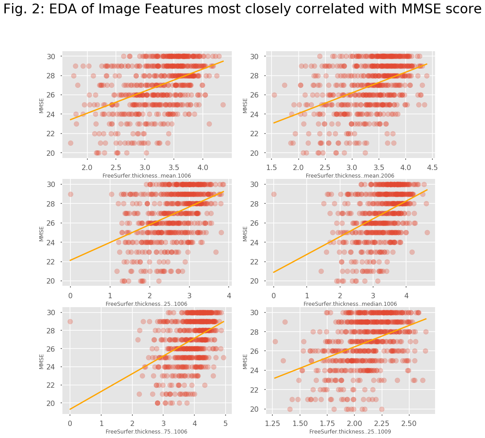
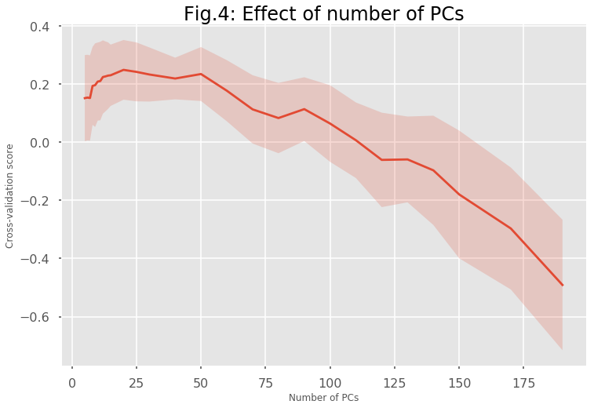
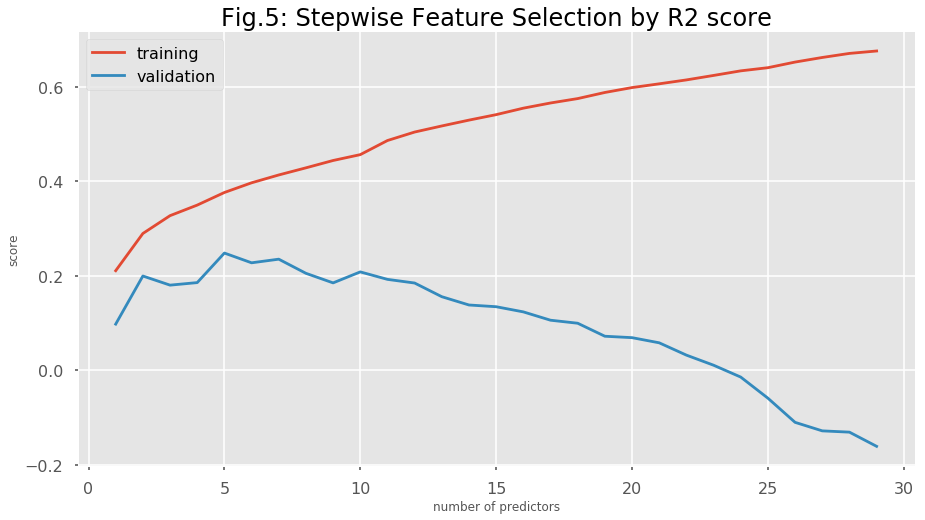
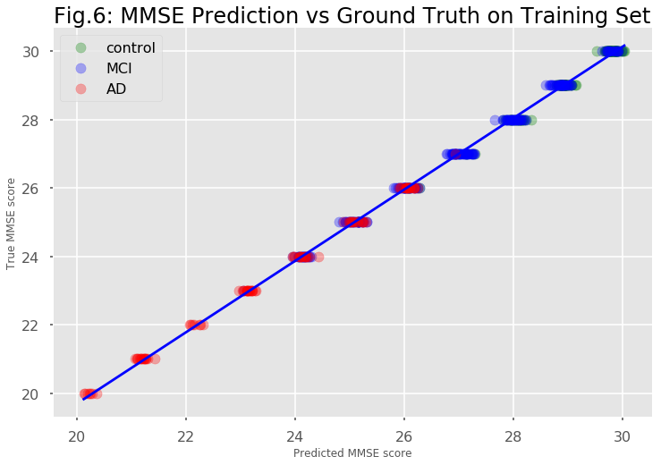
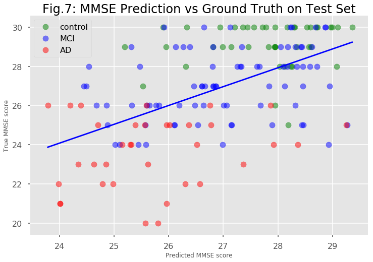
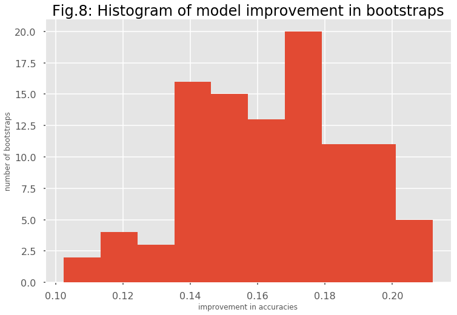

## Contents
{:.no_toc}
*  
{: toc}


  
   
    
Alzheimer's disease (AD) is characterized by 2 major diagnostic features: pathological changes in the brain namely beta-amyloid placques and deterioration of the mental state leading to cognitive impairment and ultimately dementia. Neither of these features is sufficient but both are necessary for a definitive AD diagnosis. While beta-amyloid placques are present very early during disease progression, cognitive impairment only manifests in the latest stages of the disease when a treatment is deemed impossible. In this project, we will focus on these 2 features separately and 1.) try to predict beta-amyloid placques from ???? and 2.) try to predict the mental state from brain imaging data. These 2 parts are inspired by subchallenges 2 and 3 of the ADNI Big Data DREAM Challenge.


### PART 2: Predicting mental state (MMSE) from brain imaging data (MRI)


In the second part of the project, we focus on the question if we can predict the mental state of a patient from brain imaging data. In the ADNI dataset, the mental state is represented by the Mini-Mental State Exam (MMSE) score which is the variable that we are trying to predict in this part of the project.
Since the psychological pathology develops relatively late in the disease progression, it would be advantageous to be able to predict the mental state from MRI brain imaging data which is routinely acquired in clinical settings (e.g. to exclude other types of dementia). In our analysis, we follow closely the the guidelines given in the AD Big Data Dream Challenge Subchallenge 3 (https://www.synapse.org/#!Synapse:syn2290704/wiki/64635).   
  
We downloaded the data for this challenge from https://ida.loni.usc.edu/pages/access/studyData.jsp?categoryId=43&subCategoryId=94 (password-protected login).

Initial Data Exploration:
The data in the baseline_data.csv file consists of 628 rows corresponding to unique observations of 628 patients. It contains 2150 measurements of brain geometry derived from 3D MRI images, e.g. area, thickness, curvature, etc. of different brain regions. It can be assumed that many of these variables are correlated with each other because of geometrical necessity.
The spreadsheeet also contains demographic data such as education, ethnicity, gender, race and age as well as some diagnostic data: MMSE score, Diagnosis, Apoe4 genotype. The Apoe4 allele is a polymorphism of the Apo E gene that is associated with AD susceptibility. In addition, there is an indicator variable for Apoe4 imputation.  


```python
import warnings
warnings.filterwarnings('ignore')

import pickle

import numpy as np
import pandas as pd
import matplotlib
import matplotlib.pyplot as plt
import sklearn.metrics as metrics
from scipy import stats
from sklearn.model_selection import cross_val_score
from sklearn.model_selection import GridSearchCV
from sklearn.model_selection import train_test_split

import statsmodels.api as sm
from statsmodels.api import OLS

from sklearn.model_selection import KFold
from sklearn.decomposition import PCA
from sklearn.linear_model import LinearRegression
from sklearn.linear_model import Ridge
from sklearn.linear_model import RidgeCV
from sklearn.linear_model import ElasticNetCV
from sklearn.linear_model import ElasticNet
from sklearn.utils import resample
from sklearn.model_selection import cross_val_score
from sklearn.metrics import accuracy_score
from sklearn.metrics import r2_score
from sklearn.ensemble import GradientBoostingRegressor
from sklearn.ensemble import RandomForestRegressor

from scipy.stats import pearsonr
from scipy.stats import ttest_1samp
from sklearn.linear_model import LogisticRegression
from sklearn.linear_model import LogisticRegressionCV

import seaborn.apionly as sns
sns.set_context("poster")
from IPython.display import display
matplotlib.style.use('ggplot')
%matplotlib inline

```


```python
def ccc_function(y,y_hat):
    pcc, _ = pearsonr(y_hat,y)
    ccc = 2 * pcc * y.std() * y_hat.std()/(y.var() + y_hat.var() + (y.mean() - y_hat.mean())**2)
    return ccc
```


```python
def evaluate_and_store(y_train,y_hat_train,y_test,y_hat_test,name,summary):
    # input:
    # y_train,y_hat_train,y_test,y_hat_test
    # summary: dictionary with fields model name, R2train, R2test, PCC and CCC
    pcc, _ = pearsonr(y_test,y_hat_test)
    ccc = ccc_function(y_test,y_hat_test)
    r2train = r2_score(y_train,y_hat_train)
    r2test = r2_score(y_test,y_hat_test)
    summary['model name'].append(name)
    summary['R2train'].append(r2train)
    summary['R2test'].append(r2test)
    summary['PCC'].append(pcc)
    summary['CCC'].append(ccc)
    return r2train,r2test,pcc,ccc,summary

summary = {'model name':[],'R2train':[],'R2test':[],"PCC":[],'CCC':[]}

```


## Data Cleaning and EDA

  
  
We load the data and have a look at the imaging part and the demographic part.


```python
#read data from file
data = pd.read_csv('baseline_data.csv')
print(data.shape)

print(len(data.RID.unique()))

#split data into image data and demographic data
image_data = data.iloc[:,:-13].copy()
demographic = data.iloc[:,-13:].copy()
mmse = data['MMSE']
dx = (data['DX.bl'] == 'LMCI') * 1. + (data['DX.bl'] == 'AD') * 2.

display(image_data.head())
display(demographic.head())
```


    (628, 2163)
    628


<div>
<style>
    .dataframe thead tr:only-child th {
        text-align: right;
    }

    .dataframe thead th {
        text-align: left;
    }

    .dataframe tbody tr th {
        vertical-align: top;
    }
</style>
<table border="1" class="dataframe">
  <thead>
    <tr style="text-align: right;">
      <th></th>
      <th>area.1002</th>
      <th>area.1003</th>
      <th>area.1005</th>
      <th>area.1006</th>
      <th>area.1007</th>
      <th>area.1008</th>
      <th>area.1009</th>
      <th>area.1011</th>
      <th>area.1012</th>
      <th>area.1013</th>
      <th>...</th>
      <th>Thickness..thickinthehead..2021</th>
      <th>Thickness..thickinthehead..2022</th>
      <th>Thickness..thickinthehead..2024</th>
      <th>Thickness..thickinthehead..2025</th>
      <th>Thickness..thickinthehead..2028</th>
      <th>Thickness..thickinthehead..2029</th>
      <th>Thickness..thickinthehead..2030</th>
      <th>Thickness..thickinthehead..2031</th>
      <th>Thickness..thickinthehead..2034</th>
      <th>Thickness..thickinthehead..2035</th>
    </tr>
  </thead>
  <tbody>
    <tr>
      <th>0</th>
      <td>612.577638</td>
      <td>2514.366512</td>
      <td>1652.050796</td>
      <td>731.718725</td>
      <td>3794.131041</td>
      <td>5012.960558</td>
      <td>4951.994756</td>
      <td>5666.361234</td>
      <td>2568.454160</td>
      <td>3147.024829</td>
      <td>...</td>
      <td>0.2927</td>
      <td>0.3276</td>
      <td>0.3645</td>
      <td>0.4358</td>
      <td>0.4446</td>
      <td>0.3887</td>
      <td>0.4558</td>
      <td>0.4107</td>
      <td>0.3230</td>
      <td>0.4806</td>
    </tr>
    <tr>
      <th>1</th>
      <td>735.292087</td>
      <td>2435.629408</td>
      <td>1947.966106</td>
      <td>721.230657</td>
      <td>4101.035394</td>
      <td>4469.814924</td>
      <td>4002.936490</td>
      <td>5427.875646</td>
      <td>2778.342103</td>
      <td>3907.628206</td>
      <td>...</td>
      <td>0.3240</td>
      <td>0.3247</td>
      <td>0.3886</td>
      <td>0.4416</td>
      <td>0.4823</td>
      <td>0.3790</td>
      <td>0.4650</td>
      <td>0.4499</td>
      <td>0.3923</td>
      <td>0.5315</td>
    </tr>
    <tr>
      <th>2</th>
      <td>1080.976588</td>
      <td>2190.801306</td>
      <td>1613.620315</td>
      <td>636.078912</td>
      <td>5146.969073</td>
      <td>6192.609394</td>
      <td>4640.889149</td>
      <td>6854.023127</td>
      <td>3282.902615</td>
      <td>3677.408865</td>
      <td>...</td>
      <td>0.2343</td>
      <td>0.2491</td>
      <td>0.2727</td>
      <td>0.3267</td>
      <td>0.3098</td>
      <td>0.3001</td>
      <td>0.3069</td>
      <td>0.3129</td>
      <td>0.2369</td>
      <td>0.3357</td>
    </tr>
    <tr>
      <th>3</th>
      <td>840.850798</td>
      <td>2293.601605</td>
      <td>1599.807666</td>
      <td>729.344575</td>
      <td>3351.924971</td>
      <td>4231.417941</td>
      <td>3991.795466</td>
      <td>5047.106646</td>
      <td>2599.222056</td>
      <td>3339.590461</td>
      <td>...</td>
      <td>0.2643</td>
      <td>0.2978</td>
      <td>0.3116</td>
      <td>0.3823</td>
      <td>0.3976</td>
      <td>0.3235</td>
      <td>0.3808</td>
      <td>0.3769</td>
      <td>0.2902</td>
      <td>0.4899</td>
    </tr>
    <tr>
      <th>4</th>
      <td>592.882184</td>
      <td>1827.195664</td>
      <td>1479.821407</td>
      <td>535.558408</td>
      <td>3459.934118</td>
      <td>5063.103074</td>
      <td>3583.954659</td>
      <td>4120.492969</td>
      <td>2462.352998</td>
      <td>2737.467877</td>
      <td>...</td>
      <td>0.2603</td>
      <td>0.3267</td>
      <td>0.3871</td>
      <td>0.4370</td>
      <td>0.4861</td>
      <td>0.3592</td>
      <td>0.4216</td>
      <td>0.4238</td>
      <td>0.3356</td>
      <td>0.4893</td>
    </tr>
  </tbody>
</table>
<p>5 rows × 2150 columns</p>
</div>


<div>
<style>
    .dataframe thead tr:only-child th {
        text-align: right;
    }

    .dataframe thead th {
        text-align: left;
    }

    .dataframe tbody tr th {
        vertical-align: top;
    }
</style>
<table border="1" class="dataframe">
  <thead>
    <tr style="text-align: right;">
      <th></th>
      <th>directory.id</th>
      <th>Subject</th>
      <th>RID</th>
      <th>Image.Data.ID</th>
      <th>DX.bl</th>
      <th>AGE</th>
      <th>PTGENDER</th>
      <th>PTEDUCAT</th>
      <th>PTETHCAT</th>
      <th>PTRACCAT</th>
      <th>APOE4</th>
      <th>MMSE</th>
      <th>imputed_genotype</th>
    </tr>
  </thead>
  <tbody>
    <tr>
      <th>0</th>
      <td>178eeac87ff2460568a8709ba32f9b1e</td>
      <td>002_S_0295</td>
      <td>295</td>
      <td>45108</td>
      <td>CN</td>
      <td>84.8</td>
      <td>Male</td>
      <td>18</td>
      <td>Not Hisp/Latino</td>
      <td>White</td>
      <td>1</td>
      <td>28</td>
      <td>True</td>
    </tr>
    <tr>
      <th>1</th>
      <td>4d953ce78fb484052e8b735e5493770a</td>
      <td>002_S_0413</td>
      <td>413</td>
      <td>45117</td>
      <td>CN</td>
      <td>76.3</td>
      <td>Female</td>
      <td>16</td>
      <td>Not Hisp/Latino</td>
      <td>White</td>
      <td>0</td>
      <td>29</td>
      <td>True</td>
    </tr>
    <tr>
      <th>2</th>
      <td>da022a5df80d136d3aa26bfa06702278</td>
      <td>002_S_0619</td>
      <td>619</td>
      <td>48617</td>
      <td>AD</td>
      <td>77.5</td>
      <td>Male</td>
      <td>12</td>
      <td>Not Hisp/Latino</td>
      <td>White</td>
      <td>2</td>
      <td>22</td>
      <td>False</td>
    </tr>
    <tr>
      <th>3</th>
      <td>7d700a43e372c9dfabd6c2dfdc0edcf8</td>
      <td>002_S_0685</td>
      <td>685</td>
      <td>40683</td>
      <td>CN</td>
      <td>89.6</td>
      <td>Female</td>
      <td>16</td>
      <td>Not Hisp/Latino</td>
      <td>White</td>
      <td>0</td>
      <td>30</td>
      <td>True</td>
    </tr>
    <tr>
      <th>4</th>
      <td>c033f6026da1179ab7b5f7e4f5559f59</td>
      <td>002_S_0729</td>
      <td>729</td>
      <td>40708</td>
      <td>LMCI</td>
      <td>65.1</td>
      <td>Female</td>
      <td>16</td>
      <td>Not Hisp/Latino</td>
      <td>White</td>
      <td>1</td>
      <td>27</td>
      <td>True</td>
    </tr>
  </tbody>
</table>
</div>


There is a clear correlation of MMSE score with the diagnosis of the patient. Healthy control patients (CN) have an MMSE score near the maximum of 30, whereas patients with light cognitive impairment (LMCI) have a lower median MMSE and Alzheimer's disease patients (AD) have the lowest median MMSE score.  This indicates that MMSE can be used to predict Alzheimer's disease or dementia in general.  
The MMSE score is also strongly correlated with the Apoe4 genotype. In particular, individuals that are homozygous for the Apoe4 allele, i.e. they have 2 copies of it, display a lower MMSE score.  
On the other hand, other demographic predictors like gender or age do not appear to be strongly correlated with the MMSE score.  
  
   
We now try to find the features in the imaging data that are most correlated with the MMSE score:


    image measurements most closely correlated with mmse score:
    ['FreeSurfer.thickness..mean.1006' 'FreeSurfer.thickness..mean.2006'
     'FreeSurfer.thickness..25..1006' 'FreeSurfer.thickness..median.1006'
     'FreeSurfer.thickness..75..1006' 'FreeSurfer.thickness..25..1009']


```python
fig2 = plt.figure(figsize= [15,15])

for i,feature in enumerate(best6):
    plt.subplot(3,2,i+1)
    plt.scatter(image_data[feature],mmse,alpha=0.3)
    plt.xlabel(feature)
    plt.ylabel('MMSE')
    beta1,beta0 = np.polyfit(image_data[feature],mmse,deg=1)
    f = lambda x: beta1 * x + beta0
    x = np.array([np.min(image_data[feature]), np.max(image_data[feature])])
    plt.plot(x,f(x),c='orange')
    sns.despine()
fig2.suptitle('Fig. 2: EDA of Image Features most closely correlated with MMSE score',fontsize= 30);  
```





Some of the features in the imaging data appear to be strongly correlated with the MMSE score which makes the analysis/prediction promising. 
We also notice that we now have 2159 predictors which is a lot more than the 628 observations we have in our complete dataset. This causes a big danger of overfitting any training data.  
We next clean up the demographic variables and split our data into training and test sets. We group all the predictors (demographic + MRI imaging) together and extract 2 outcome variables: 1.) the MMSE score which we want to predict, and 2.) the diagnosis which we will use to evaluate the usefulness of our MMSE prediction in the last part.  
Then we will check if we  have multi-colinearity in the imaging predictors.


```python

demographic['PTETHCAT'] = (demographic.PTETHCAT == 'Hisp/Latino') * 1.

demographic = pd.get_dummies(demographic,columns=['PTRACCAT','APOE4'],drop_first=True)

demographic['PTGENDER'] = (demographic.PTGENDER == 'Female') * 1.

demographic['imputed_genotype'] = (demographic.imputed_genotype == True)* 1.

y = mmse
y_dx = dx

image_columns = image_data.columns.values

demographic_columns = ['AGE','PTGENDER','PTEDUCAT','PTETHCAT','imputed_genotype','PTRACCAT_Black','PTRACCAT_White','APOE4_1','APOE4_2']


X = pd.concat([image_data,demographic[demographic_columns]],axis=1)
print('number of observations: ',X.shape[0])
print('number of predictors: ',X.shape[1])

#check that there is no NaN's in the data
print('number of NULL values: ',np.sum(np.sum(X.isnull())))

X_train, X_test, y_train, y_test, y_dx_train, y_dx_test = train_test_split(X,y,y_dx,train_size = 0.75,random_state=8)


mean = X_train.mean(axis=0)
std = X_train.std(axis=0)

X_train = (X_train - mean)/std
X_test = (X_test - mean)/std
```


    number of observations:  628
    number of predictors:  2159
    number of NULL values:  0


```python

with open('mmse_data1.pickle', 'wb') as f:
    pickle.dump((X_train,X_test,y_train,y_test,y_dx_train,y_dx_test,summary), f, protocol=pickle.HIGHEST_PROTOCOL)
   
```


## Checking Multi-Colinearity in the Imaging Data
  
  
    
We calculate a correlation matrix between the predictors and display it as a heatmap.


```python
corr_mat = np.corrcoef(X_train.as_matrix().T)

fig3 = plt.figure(figsize = [15,15])
ax = plt.gca()
plt.set_cmap("bwr")
heatmap = plt.imshow(corr_mat)
plt.title('Fig. 3: Heatmap of Correlation Matrix of all Predictors',fontsize=24);
plt.colorbar(heatmap);
```


There is a lot of colinearity between the predictors in the imaging data. Colinear variables appear to be organized in ordered blocks. In order to get a working prediction model, we will have to reduce the dimensionality and co-linearity  to reduce the danger of overfitting to the training set.

## Baseline Model: Simple Linear Regression

We first try a simple linear regression model with all predictors and MMSE as the outcome.


```python
with open('mmse_data1.pickle', 'rb') as f:
    (X_train,X_test,y_train,y_test,y_dx_train,y_dx_test,summary) = pickle.load(f)
```


```python

simple_est = LinearRegression(fit_intercept = True)
simple_est.fit(X_train,y_train)
y_hat_train = simple_est.predict(X_train)
y_hat_test = simple_est.predict(X_test)

name = 'linear regression with all predictors'
r2train, r2test, pcc, ccc, summary = evaluate_and_store(y_train,y_hat_train,y_test,y_hat_test,name,summary)

print(name,': ')
print('R2 score on training set: ',r2train)
print('R2 score on validation set: ',r2test)
print("Pearson's correlation coefficient between estimate and ground truth(test set)", pcc)
print("Concordance correlation coefficient between estimate and ground truth(test set)", ccc)
```


    linear regression with all predictors : 
    R2 score on training set:  1.0
    R2 score on validation set:  -0.575703582103
    Pearson's correlation coefficient between estimate and ground truth(test set) 0.292637073937
    Concordance correlation coefficient between estimate and ground truth(test set) 0.29124810158


Because of the large number of predictors and the multi-colinearity of the predictors, the model with all predictors suffers from high variance. Overall, variance appears to be the biggest problem in predicting this dataset. We will use principal components analysis, stepwise feature selection and ensemble strategies to reduce the dimensionality and eliminate colinearity. In addition, we will use regularization to further reduce variance problems.

## Principal Component Analysis and Regularized Linear Regression
  
    
    
First, we reduce the dimensionality by principal component analysis and keep enough principal components that capture 90% of the variance in the data. 


```python
fullpca = PCA(n_components = 0.9,svd_solver = 'full')
X_train_pca = fullpca.fit_transform(X_train)
X_test_pca = fullpca.transform(X_test)
total_pcs = X_train_pca.shape[1]
print("Number of PCs accounting for 90% of variance: ", total_pcs)
```


    Number of PCs accounting for 90% of variance:  197


We still have 197 predictors left after principal component analysis. Let's try a simple linear regression model:


```python
pca_lin_est = LinearRegression(fit_intercept = True)
pca_lin_est.fit(X_train_pca,y_train)
y_hat_train = pca_lin_est.predict(X_train_pca)
y_hat_test = pca_lin_est.predict(X_test_pca)

name = 'linear regression on {} PCs'.format(total_pcs)
r2train, r2test, pcc, ccc, summary = evaluate_and_store(y_train,y_hat_train,y_test,y_hat_test,name,summary)

print(name,': ')
print('R2 score on training set: ',r2train)
print('R2 score on validation set: ',r2test)
print("Pearson's correlation coefficient between estimate and ground truth(test set)", pcc)
print("Concordance correlation coefficient between estimate and ground truth(test set)", ccc)
```


    linear regression on 197 PCs : 
    R2 score on training set:  0.607144507434
    R2 score on validation set:  0.146129866785
    Pearson's correlation coefficient between estimate and ground truth(test set) 0.462698583976
    Concordance correlation coefficient between estimate and ground truth(test set) 0.434770218566


We still have a relatively high discrepancy between performance on the training and test set which is indicative of variance problems. Even though we have eliminated co-linearity between predictors through PCA, this does not mean that each of our predictors is correlated with our outcome variable MMSE. We will try different types of regularization to reduce variance and improve our bias/variance trade-off.  
We first try ridge regularization with cross-validation to identify the ideal regularization weight hyper-parameter, then train on the whole training set with the optimal parameter.


```python
alphas = [100000,50000,10000,5000,1000,500,100,50,10,5,1,0.5,0.1,0.05,0.01]

ridge_pca_est = RidgeCV(alphas=alphas,fit_intercept = True,cv=5)
ridge_pca_est.fit(X_train_pca,y_train)
best_alpha = ridge_pca_est.alpha_

ridge_pca_est = Ridge(alpha=best_alpha,fit_intercept = True)
ridge_pca_est.fit(X_train_pca,y_train)
y_hat_train = ridge_pca_est.predict(X_train_pca)
y_hat_test = ridge_pca_est.predict(X_test_pca)

name = 'ridge regression with {} PCs'.format(total_pcs)
r2train, r2test, pcc, ccc, summary = evaluate_and_store(y_train,y_hat_train,y_test,y_hat_test,name,summary)

print(name,': ')
print('Regularization parameter: ', best_alpha)
print('R2 score on training set: ',r2train)
print('R2 score on validation set: ',r2test)
print("Pearson's correlation coefficient between estimate and ground truth(test set)", pcc)
print("Concordance correlation coefficient between estimate and ground truth(test set)", ccc)
```


    ridge regression with 197 PCs : 
    Regularization parameter:  5000
    R2 score on training set:  0.471061556011
    R2 score on validation set:  0.265014380849
    Pearson's correlation coefficient between estimate and ground truth(test set) 0.518424013095
    Concordance correlation coefficient between estimate and ground truth(test set) 0.419587774173


This has improved our R2 score on the test set quite dramatically. We try another type of regularization, Elastic Net regularization. This method combines L1 (Lasso) and L2 (Ridge) regularization. We cross-validate for regularization strength and the ratio between L1 and L2.


```python
ratios = [.001,.01,.1, .5, .7, .9, .95, .99, 1]
elnet_est = ElasticNetCV(l1_ratio = ratios, alphas=alphas,fit_intercept = True,cv=5)
elnet_est.fit(X_train_pca,y_train)
best_alpha = elnet_est.alpha_
best_ratio = elnet_est.l1_ratio_

elnet_est = ElasticNet(l1_ratio = best_ratio, alpha=best_alpha,fit_intercept = True)
elnet_est.fit(X_train_pca,y_train)
y_hat_train = elnet_est.predict(X_train_pca)
y_hat_test = elnet_est.predict(X_test_pca)

name = 'Elastic Net regression with {} PCs'.format(total_pcs)
r2train, r2test, pcc, ccc, summary = evaluate_and_store(y_train,y_hat_train,y_test,y_hat_test,name,summary)

print(name,': ')
print('Regularization parameter: ', best_alpha)
print('L1 ratio: ',best_ratio)
print('R2 score on training set: ',r2train)
print('R2 score on validation set: ',r2test)
print("Pearson's correlation coefficient between estimate and ground truth(test set)", pcc)
print("Concordance correlation coefficient between estimate and ground truth(test set)", ccc)
```


    Elastic Net regression with 197 PCs : 
    Regularization parameter:  10.0
    L1 ratio:  0.01
    R2 score on training set:  0.430632422622
    R2 score on validation set:  0.267113344982
    Pearson's correlation coefficient between estimate and ground truth(test set) 0.52064312814
    Concordance correlation coefficient between estimate and ground truth(test set) 0.41525211834


The Elastic Net regularization has not improved our model compared to ridge regularization. Moreover, the optimal ratio between L1 and L2 regularization  is very close to pure L2 regularization, further confirming ridge regularization as the optimal decision in this scenario.

As an alternative to regularization, we try to determine the optimal number of PCs in a simple linear regression model.


```python
scorelist = []

#pcs = range(1,total_pcs+1)
pcs = [5,6,7,8,9,10,11,12,13,14,15,20,25,30,40,50,60,70,80,90,100,110,120,130,140,150,170,190]
for use_pcs in pcs:
    scores = cross_val_score(pca_lin_est,X_train_pca[:,:use_pcs],y_train,cv=5)
    scorelist.append(scores)
    
#plot crossvalidation score means and std as a function of number of PCs
score_array = np.vstack(scorelist)    
valid_means = score_array.mean(axis=1)
valid_stds = score_array.std(axis=1)

fig4 = plt.figure(figsize = [12,8])
plt.title('Fig.4: Effect of number of PCs', fontsize = 24)
ax = plt.gca()
plt.plot(pcs,valid_means)
ax.fill_between(pcs,valid_means+valid_stds,valid_means-valid_stds,alpha = 0.2)
ax.set_ylabel('Cross-validation score')
ax.set_xlabel('Number of PCs')
sns.despine()

optimal_pcs = pcs[np.argmax(valid_means)]
print("\nOptimal number of principal components: ",optimal_pcs)


pca_lin_est.fit(X_train_pca[:,:optimal_pcs],y_train)

y_hat_train = pca_lin_est.predict(X_train_pca[:,:optimal_pcs])
y_hat_test = pca_lin_est.predict(X_test_pca[:,:optimal_pcs])

name = 'linear regression with {} PCs'.format(optimal_pcs)
r2train, r2test, pcc, ccc, summary = evaluate_and_store(y_train,y_hat_train,y_test,y_hat_test,name,summary)

print(name,': ')
print('R2 score on training set: ',r2train)
print('R2 score on validation set: ',r2test)
print("Pearson's correlation coefficient between estimate and ground truth(test set)", pcc)
print("Concordance correlation coefficient between estimate and ground truth(test set)", ccc)
```


    
    Optimal number of principal components:  20
    linear regression with 20 PCs : 
    R2 score on training set:  0.321961145795
    R2 score on validation set:  0.226915996482
    Pearson's correlation coefficient between estimate and ground truth(test set) 0.486073194638
    Concordance correlation coefficient between estimate and ground truth(test set) 0.41508971522





Based on our cross-validation results, including the first 5 principal components yields the best test R2 score. The test R2 score of this unregularized model with 20 PCs is comparable to the Ridge regression model on all 197 PCs. Further regularization does not improve this model (data not shown).

## Step-wise feature selection based on cross-validation score
  
    
In lieu of PCA, we also try dimensionality reduction by step-wise feature selection. We first split our training set into a smaller training set to stepwise select predictors and a validation set to select the number of predictors to keep. We use a simple linear regression model for this purpose.


```python
X_train_sm, X_valid,y_train_sm,y_valid = train_test_split(X_train,y_train,test_size= 150,random_state = 7)

all_predictors = X_train.columns.values
predictors = []

max_predictors = 30 
for k in range(1, max_predictors):
    
    if k == 1:
        used_predictors = []
    else:
        used_predictors = predictors[-1]
    
    # get currently unused predictors
    unused_predictors = list(set(all_predictors) - set(used_predictors))
    
    # add each of the unused predictors one at a time and store the mean of cross-validation scores
    xvalscores = []
    for predictor in unused_predictors:
        # cross validate with chosen predictors on small training set
        k_predictors = used_predictors + [predictor]
        X_train_k = X_train_sm[k_predictors]
        linreg_est = LinearRegression(fit_intercept = True)
        kf = KFold(n_splits=3, shuffle=True, random_state=7)
        score = cross_val_score(linreg_est,X_train_k,y_train_sm,cv=kf).mean()
        xvalscores.append(score)
    
    # then choose the predictor that gives the best cross-validation score and add it to the list of used predictors
    best_k = used_predictors + [unused_predictors[np.argmax(xvalscores)]]
    predictors.append(best_k)
```


```python
train_scores = []
valid_scores = []
for p in predictors:
    #fit a linear regression model with chosen set of predictors on small training set
    linreg_est.fit(X_train_sm[p],y_train_sm)
    
    # get R2 score for small training set and validation set
    y_hat_train_sm = linreg_est.predict(X_train_sm[p])
    y_hat_valid = linreg_est.predict(X_valid[p])
    
    train_scores.append(r2_score(y_train_sm,y_hat_train_sm))
    valid_scores.append(r2_score(y_valid,y_hat_valid))

fig5 = plt.figure(figsize= [15,8])
plt.plot(range(1, max_predictors),train_scores)
plt.plot(range(1, max_predictors),valid_scores)
plt.title('Fig.5: Stepwise Feature Selection by R2 score',fontsize=24)
plt.xlabel('number of predictors')
plt.ylabel('score')
plt.legend(['training','validation'])

best_predictors = predictors[np.argmax(valid_scores)]

X_train_feat = X_train[best_predictors]
X_test_feat = X_test[best_predictors]

linreg_est = LinearRegression()
linreg_est.fit(X_train_feat,y_train)
y_hat_train = linreg_est.predict(X_train_feat)
y_hat_test = linreg_est.predict(X_test_feat)

name = 'linear regression with {} predictors'.format(len(best_predictors))
r2train, r2test, pcc, ccc, summary = evaluate_and_store(y_train,y_hat_train,y_test,y_hat_test,name,summary)

print(name,': ')
print('optimal number of predictors: ',len(best_predictors))
print('predictors: ',best_predictors)
print('R2 score on training set: ',r2train)
print('R2 score on validation set: ',r2test)
print("Pearson's correlation coefficient between estimate and ground truth(test set)", pcc)
print("Concordance correlation coefficient between estimate and ground truth(test set)", ccc)
```


    linear regression with 5 predictors : 
    optimal number of predictors:  5
    predictors:  ['FreeSurfer.thickness..mean.1009', 'FreeSurfer.thickness..mean.2006', 'mean.curvature..kurtosis.1007', 'geodesic.depth..SD.1011', 'PTEDUCAT']
    R2 score on training set:  0.347888052415
    R2 score on validation set:  0.263384791347
    Pearson's correlation coefficient between estimate and ground truth(test set) 0.522998265342
    Concordance correlation coefficient between estimate and ground truth(test set) 0.457283947517





This simple linear regression model with only 5 predictors a similar performance as the PCA models with an R2 score of 0.26.


```python
ridge_feat_est = RidgeCV(alphas=alphas,fit_intercept = True,cv=5)
ridge_feat_est.fit(X_train_feat,y_train)
best_alpha = ridge_feat_est.alpha_

ridge_feat_est.fit(X_train_feat,y_train)
y_hat_train = ridge_feat_est.predict(X_train_feat)
y_hat_test = ridge_feat_est.predict(X_test_feat)

name = 'linear regression model with Ridge regularization on {} PCA predictors'.format(total_pcs)
r2train, r2test, pcc, ccc, summary = evaluate_and_store(y_train,y_hat_train,y_test,y_hat_test,name,summary)

print(name,': ')
print("Regularization parameter for Ridge regularization: ",best_alpha)
print('R2 score on training set: ',r2train)
print('R2 score on validation set: ',r2test)
print("Pearson's correlation coefficient between estimate and ground truth(test set)", pcc)
print("Concordance correlation coefficient between estimate and ground truth(test set)", ccc)

```


    linear regression model with Ridge regularization on 197 PCA predictors : 
    Regularization parameter for Ridge regularization:  50
    R2 score on training set:  0.346354646594
    R2 score on validation set:  0.267638593243
    Pearson's correlation coefficient between estimate and ground truth(test set) 0.522653783263
    Concordance correlation coefficient between estimate and ground truth(test set) 0.441699871133


Regularization does not appear to improve the plain linear regression model further.

## Ensemble Methods
  
### Random Forest Regressor
  
   
Ensemble methods like Random Forest Regression or Gradient Boosting are another way to reduce the number of features being considered in the model. We first try Random Forest Regression and crossvalidate to optimize the maximum depth of the trees on a relatively small number of trees (64), we fix the number of features to the square root of all features (46). We then increase the number of trees to 512 to acchieve a slightly better model. Because of the long time it takes to compute these Random Forests we did not perform an exhaustive grid search of all hyper-parameters.


```python
rf = RandomForestRegressor(n_estimators = 64,max_features = 'sqrt',random_state=7)

parameters = {'max_depth':[i for i in range(3,15)]}
gs_rf = GridSearchCV(rf,parameters)
gs_rf.fit(X_train,y_train)
print(gs_rf.best_estimator_)
print('optimal max_depth: ',gs_rf.best_estimator_.max_depth)
```


    RandomForestRegressor(bootstrap=True, criterion='mse', max_depth=6,
               max_features='sqrt', max_leaf_nodes=None,
               min_impurity_decrease=0.0, min_impurity_split=None,
               min_samples_leaf=1, min_samples_split=2,
               min_weight_fraction_leaf=0.0, n_estimators=64, n_jobs=1,
               oob_score=False, random_state=7, verbose=0, warm_start=False)
    optimal max_depth:  6


```python
rf_est = RandomForestRegressor(n_estimators = 512,max_features = 'sqrt',max_depth = 7)
rf_est.fit(X_train,y_train)
y_hat_train = rf_est.predict(X_train)
y_hat_test = rf_est.predict(X_test)

name = 'Random Forest Regressor with all predictors'
r2train, r2test, pcc, ccc, summary = evaluate_and_store(y_train,y_hat_train,y_test,y_hat_test,name,summary)

print(name,': ')
print('R2 score on training set: ',r2train)
print('R2 score on validation set: ',r2test)
print("Pearson's correlation coefficient between estimate and ground truth(test set)", pcc)
print("Concordance correlation coefficient between estimate and ground truth(test set)", ccc)

```


    Random Forest Regressor with all predictors : 
    R2 score on training set:  0.796739832447
    R2 score on validation set:  0.240607085902
    Pearson's correlation coefficient between estimate and ground truth(test set) 0.497885936163
    Concordance correlation coefficient between estimate and ground truth(test set) 0.351548345382


At least for the limited set of hyper-parameters we tested, the random forest model does not perform as well as our previous models.

### Gradient Boosting Regressor
  
We then tried a Gradient Boosting Regressor for our prediction using crossvalidation to determine the optimal depth of the individual estimators as well as the number of estimators. We then retrain on the complete training set and acchieve the best model performance so far:


```python
gbr = GradientBoostingRegressor()
parameters = {'max_depth':[i for i in range(1,5)],'n_estimators':[i*50 for i in range(1,4)]}
gs_gbr = GridSearchCV(gbr,parameters)
gs_gbr.fit(X_train,y_train)
print(gs_gbr.best_estimator_)
```


    GradientBoostingRegressor(alpha=0.9, criterion='friedman_mse', init=None,
                 learning_rate=0.1, loss='ls', max_depth=4, max_features=None,
                 max_leaf_nodes=None, min_impurity_decrease=0.0,
                 min_impurity_split=None, min_samples_leaf=1,
                 min_samples_split=2, min_weight_fraction_leaf=0.0,
                 n_estimators=100, presort='auto', random_state=None,
                 subsample=1.0, verbose=0, warm_start=False)


```python
gbr_est = GradientBoostingRegressor(max_depth=4,n_estimators=100)
gbr_est.fit(X_train,y_train)

y_hat_train = gbr_est.predict(X_train)
y_hat_test = gbr_est.predict(X_test)


name = 'gradient boosting regressor with all predictors'
r2train, r2test, pcc, ccc, summary = evaluate_and_store(y_train,y_hat_train,y_test,y_hat_test,name,summary)
#display(pd.DataFrame(np.array([name,r2train, r2test, pcc, ccc]).reshape(1,-1),columns=['model name','R2 train','R2 test',\

print(name,': ')
print('R2 score on training set: ',r2train)
print('R2 score on validation set: ',r2test)
print("Pearson's correlation coefficient between estimate and ground truth(test set)", pcc)
print("Concordance correlation coefficient between estimate and ground truth(test set)", ccc)

```


    gradient boosting regressor with all predictors : 
    R2 score on training set:  0.996073175562
    R2 score on validation set:  0.289511344235
    Pearson's correlation coefficient between estimate and ground truth(test set) 0.538660917627
    Concordance correlation coefficient between estimate and ground truth(test set) 0.458527158448


```python
with open('mmse_data2.pickle', 'wb') as f:
    pickle.dump((X_train,X_test,y_train,y_test,y_dx_train,y_dx_test,summary,gbr_est), f, protocol=pickle.HIGHEST_PROTOCOL)
   
```


## Model Performance Comparison
  
  
To evaluate our models, we used 3 different metrics: R2 score, Pearson's correlation coefficient and Concordance correlation coefficient, all on the test set. The latter is the metric used in the AD DREAM challenge to score the leaderboard.


```python
with open('mmse_data2.pickle', 'rb') as f:
    (X_train,X_test,y_train,y_test,y_dx_train,y_dx_test,summary,gbr_est) = pickle.load(f)
```


```python
#load summary from file
display(pd.DataFrame(summary)[['model name','R2train','R2test','PCC','CCC']])
```


<div>
<style>
    .dataframe thead tr:only-child th {
        text-align: right;
    }

    .dataframe thead th {
        text-align: left;
    }

    .dataframe tbody tr th {
        vertical-align: top;
    }
</style>
<table border="1" class="dataframe">
  <thead>
    <tr style="text-align: right;">
      <th></th>
      <th>model name</th>
      <th>R2train</th>
      <th>R2test</th>
      <th>PCC</th>
      <th>CCC</th>
    </tr>
  </thead>
  <tbody>
    <tr>
      <th>0</th>
      <td>linear regression with all predictors</td>
      <td>1.000000</td>
      <td>-0.575704</td>
      <td>0.292637</td>
      <td>0.291248</td>
    </tr>
    <tr>
      <th>1</th>
      <td>linear regression on 197 PCs</td>
      <td>0.607145</td>
      <td>0.146130</td>
      <td>0.462699</td>
      <td>0.434770</td>
    </tr>
    <tr>
      <th>2</th>
      <td>ridge regression with 197 PCs</td>
      <td>0.471062</td>
      <td>0.265014</td>
      <td>0.518424</td>
      <td>0.419588</td>
    </tr>
    <tr>
      <th>3</th>
      <td>Elastic Net regression with 197 PCs</td>
      <td>0.430632</td>
      <td>0.267113</td>
      <td>0.520643</td>
      <td>0.415252</td>
    </tr>
    <tr>
      <th>4</th>
      <td>linear regression with 20 PCs</td>
      <td>0.321961</td>
      <td>0.226916</td>
      <td>0.486073</td>
      <td>0.415090</td>
    </tr>
    <tr>
      <th>5</th>
      <td>linear regression with 5 predictors</td>
      <td>0.347888</td>
      <td>0.263385</td>
      <td>0.522998</td>
      <td>0.457284</td>
    </tr>
    <tr>
      <th>6</th>
      <td>linear regression model with Ridge regularizat...</td>
      <td>0.346355</td>
      <td>0.267639</td>
      <td>0.522654</td>
      <td>0.441700</td>
    </tr>
    <tr>
      <th>7</th>
      <td>Random Forest Regressor with all predictors</td>
      <td>0.796740</td>
      <td>0.240607</td>
      <td>0.497886</td>
      <td>0.351548</td>
    </tr>
    <tr>
      <th>8</th>
      <td>gradient boosting regressor with all predictors</td>
      <td>0.996073</td>
      <td>0.289511</td>
      <td>0.538661</td>
      <td>0.458527</td>
    </tr>
  </tbody>
</table>
</div>


The best model in all 3 evaluation metrics (R2 score, Pearson's correlation coefficient, Concordance correlation coefficient, all on test set) is the gradient boosting regressor. Assuming our test set is representative of the test set used for the AD DREAM challenge, our Concordance correlation coefficient of 0.47 would place us on rank 8 of the final leaderboard (https://www.synapse.org/#!Synapse:syn2290704/wiki/68513). The Pearson's correlation coefficient would place us even higher. We use our optimal model to visualize how our predicted MMSE scores compare to the true MMSE scores, both on the training set and test set. We also visualize the different diagnoses classes (CN = control, MCI = mild cognitive impairment and AD = Alzheimer's disease) in these diagrams.


```python

y_hat_train = gbr_est.predict(X_train)
y_hat_test = gbr_est.predict(X_test)

idx1 = y_dx_train == 0
idx2 = y_dx_train == 1
idx3 = y_dx_train == 2

fig6 = plt.figure(figsize = [12,8])
plt.scatter(y_hat_train[idx1],y_train[idx1],alpha=0.3,c='green')
plt.scatter(y_hat_train[idx2],y_train[idx2],alpha=0.3,c='blue')
plt.scatter(y_hat_train[idx3],y_train[idx3],alpha=0.3,c='red')

plt.xlabel('Predicted MMSE score')
plt.ylabel('True MMSE score')
plt.legend(['control','MCI','AD'])

beta1,beta0 = np.polyfit(y_hat_train,y_train,deg=1)
f = lambda x: beta1 * x + beta0
x = np.array([np.min(y_hat_train), np.max(y_hat_train)])
plt.plot(x,f(x),c='blue')

plt.title('Fig.6: MMSE Prediction vs Ground Truth on Training Set',fontsize=24)
sns.despine()

idx1 = y_dx_test == 0
idx2 = y_dx_test == 1
idx3 = y_dx_test == 2

fig7 = plt.figure(figsize = [12,8])
plt.scatter(y_hat_test[idx1],y_test[idx1],alpha=0.5,c='green')
plt.scatter(y_hat_test[idx2],y_test[idx2],alpha=0.5,c='blue')
plt.scatter(y_hat_test[idx3],y_test[idx3],alpha=0.5,c='red')

plt.xlabel('Predicted MMSE score')
plt.ylabel('True MMSE score')
plt.legend(['control','MCI','AD'])
plt.title('Fig.7: MMSE Prediction vs Ground Truth on Test Set',fontsize=24)

#plot regression line
beta1,beta0 = np.polyfit(y_hat_test,y_test,deg=1)
f = lambda x: beta1 * x + beta0
x = np.array([np.min(y_hat_test), np.max(y_hat_test)])
plt.plot(x,f(x),c='blue')

sns.despine()
```








Based on the distribution of different diagnosis classes in this graph, it should be helpful to use the predicted MMSE in prediction of diagnoses.

## Influence of estimated MMSE on diagnosis prediction
  
  
We are first comparing three simple logistic regression classifiers: One that uses only the demographic data for predicting diagnosis, one that uses the actual MMSE score and one that uses our predicted MMSE score. The first achieves only 46% accuracy on the test set, whereas the second achieves 69%. The model with our predicted MMSE score is halfway between these 2 extremes with 56% accuracy.


```python
X_est_train = X_train[demographic_columns].copy()
X_est_test = X_test[demographic_columns].copy()

Cs = [100000,50000,10000,5000,1000,500,100,50,10,5,1,0.5,0.1,0.05,0.01,0.005,0.001,0.0005,0.0001,0.00005,0.00001]
logreg_clf = LogisticRegressionCV(Cs=Cs)
logreg_clf.fit(X_est_train,y_dx_train)
y_hatdx_train = logreg_clf.predict(X_est_train)
y_hatdx_test = logreg_clf.predict(X_est_test)

train_acc = np.sum(y_hatdx_train == y_dx_train)/len(y_dx_train)
test_acc = np.sum(y_hatdx_test == y_dx_test)/len(y_dx_test)

print('model with demographic factors only:')
print('training accuracy: ',train_acc)
print('test accuracy: ', test_acc)
```


    model with demographic factors only:
    training accuracy:  0.511677282378
    test accuracy:  0.464968152866


```python
X_est_train['MMSE'] = y_train
X_est_test['MMSE'] = y_test

Cs = [100000,50000,10000,5000,1000,500,100,50,10,5,1,0.5,0.1,0.05,0.01,0.005,0.001,0.0005,0.0001,0.00005,0.00001]
logreg_clf = LogisticRegressionCV(Cs=Cs)
logreg_clf.fit(X_est_train,y_dx_train)
y_hatdx_train = logreg_clf.predict(X_est_train)
y_hatdx_test = logreg_clf.predict(X_est_test)

train_acc = np.sum(y_hatdx_train == y_dx_train)/len(y_dx_train)
test_acc = np.sum(y_hatdx_test == y_dx_test)/len(y_dx_test)

print('model with demographic factors + true MMSE score:')
print('training accuracy: ',train_acc)
print('test accuracy: ', test_acc)
```


    model with demographic factors + true MMSE score:
    training accuracy:  0.713375796178
    test accuracy:  0.694267515924


```python
X_est_train['MMSE'] = y_hat_train
X_est_test['MMSE'] = y_hat_test

Cs = [100000,50000,10000,5000,1000,500,100,50,10,5,1,0.5,0.1,0.05,0.01,0.005,0.001,0.0005,0.0001,0.00005,0.00001]
logreg_clf = LogisticRegressionCV(Cs=Cs)
logreg_clf.fit(X_est_train,y_dx_train)
y_hatdx_train = logreg_clf.predict(X_est_train)
y_hatdx_test = logreg_clf.predict(X_est_test)

train_acc = np.sum(y_hatdx_train == y_dx_train)/len(y_dx_train)
test_acc = np.sum(y_hatdx_test == y_dx_test)/len(y_dx_test)

print('model with demographic factors + our estimated MMSE score:')
print('training accuracy: ',train_acc)
print('test accuracy: ', test_acc)
```


    model with demographic factors + our estimated MMSE score:
    training accuracy:  0.71974522293
    test accuracy:  0.56050955414


In order to getter a better estimate and a significance value for the improvement, we perform bootstrapping by resampling our training set with replacement, use the remaining observations as test set and determine the difference in test accuracies between the base model and our (putatively) improved model.


```python
num_iterations = 100
train_size = X_est_train.shape[0]
data = pd.concat([pd.concat([X_est_train,X_est_test]),pd.concat([y_dx_train,y_dx_test])],axis=1).values

test_acc_diffs = []

for i in range(num_iterations):
    # prepare train and test sets
    train = resample(data, n_samples=train_size)
    test = np.array([x for x in data if x.tolist() not in train.tolist()])
    X_train_bs = train[:,:-1]
    y_train_bs = train[:,-1]
    X_test_bs = test[:,:-1]
    y_test_bs = test[:,-1]
    
    # fit base model without mmse
    logreg_clf = LogisticRegressionCV(Cs=Cs)
    logreg_clf.fit(X_train_bs[:,:-1],y_train_bs)
    y_hat_base = logreg_clf.predict(X_test_bs[:,:-1])
    acc_base = np.sum(y_hat_base == y_test_bs)/len(y_test_bs)
    
    # fit mmse model 
    logreg_clf.fit(X_train_bs,y_train_bs)
    y_hat_mmse = logreg_clf.predict(X_test_bs)
    acc_mmse = np.sum(y_hat_mmse == y_test_bs)/len(y_test_bs)
    
    test_acc_diffs.append(acc_mmse - acc_base)

fig8 = plt.figure(figsize = [12,8])
plt.hist(test_acc_diffs)
plt.xlabel('improvement in accuracies')
plt.ylabel('number of bootstraps')
plt.title('Fig.8: Histogram of model improvement in bootstraps',fontsize=24);
```





```python
_,pval = ttest_1samp(test_acc_diffs,popmean=0)
print('mean improvement by inclusion of predicted MMSE score: ',np.mean(test_acc_diffs))
print('Null Hypothesis: Including predicted MMSE has no effect on accuracy of classifier')
print('p-value: ', pval)
```


    mean improvement by inclusion of predicted MMSE score:  0.163971146855
    Null Hypothesis: Including predicted MMSE has no effect on accuracy of classifier
    p-value:  1.58407894389e-84


The improvement in test accuracies is roughly normally distributed and has a mean of 17%. Based on a paired t-test, these effects are highly significant.

## Discussion
  
  
We have shown that our best models can compete with other submissions to the AD DREAM challenge and even outperform 2/3 of the submissions. We have also shown that the predicted MMSE scores from our best model are good enough to significantly improve Alzheimer's Disease/Dementia diagnosis. However, given more time, there might be ways to further improve our model: We currently use preprocessed geometrical data to approximate brain morphology as our predictors; the raw MRI data might contain information that is not captured by this data. Training a deep neural net on raw MRI images might improve our prediction.  
It is remarkable that a number of our models is performing relatively well. Combining these models by stacking might further improve our prediction.


```python

```

